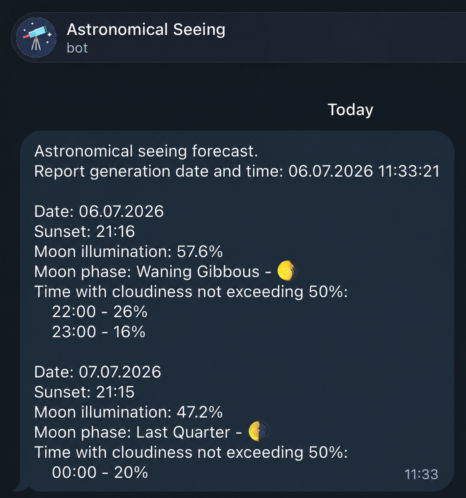

# 🌌 Astronomical Seeing Telegram Bot

A Python-based Telegram bot designed for astrophotographers and stargazers. It automates the process of finding the optimal "visibility window" by fetching, aggregating, and filtering weather and astronomical data via the Meteoblue API.

The bot calculates lunar illumination, tracks sunset times, and applies user-defined thresholds for cloud cover to send targeted notifications via Telegram.

## Report Example



## 🚀 Features
* **Data Aggregation:** Consumes the Meteoblue API to fetch hourly cloud cover, sunset times, and moon phases.
* **Custom Mathematical Processing:** Accurately calculates midnight lunar illumination based on midday data and current moon phases.
* **Smart Filtering:** Drops outdated data and filters the timeline based on configurable thresholds (e.g., "Show me only hours after sunset with < 20% cloudiness").
* **Jinja2 Templating:** Generates clean, human-readable Telegram reports.
* **Strict Configuration Validation:** Uses the `schema` library to prevent startup crashes due to malformed YAML configs.
* **Dockerized:** Ready to be deployed as a container with externalized configuration.

## 🛠 Tech Stack
* **Language:** Python 3.10
* **Libraries:** `requests`, `PyYAML`, `schema` (validation), `Jinja2` (templating)
* **Infrastructure:** Docker

## ⚙️ Setup and Configuration

1. Clone the repository.
2. Rename `config.example.yml` to `config.yml`.
3. Fill in the required parameters in `config.yml` (API keys, Telegram tokens, coordinates, and filters).

*Note: `config.yml` is ignored by Git to prevent accidental exposure of sensitive tokens.*

## 🐳 Deployment (Docker)

The project includes a `Dockerfile` and is designed to run in a containerized environment. To keep secrets secure, pass your configuration file via Docker volumes.

1. Build the image:
```bash
docker build -t astronomical-seeing .
```

2. Run the container (mounting your local `config.yml` inside the container):
```bash
docker run -d --name astronomical-seeing -v $(pwd)/config.yml:/app/config.yml astronomical-seeing
```

## 📂 Project Structure

* `/modules/data_providers` - API interactions and configuration loader.
* `/modules/data_processing` - Core business logic, mathematical algorithms, and data filtering.
* `/modules/data_presentation` - Jinja2 templating and Telegram integration.
* `main.py` - Application entry point with global exception handling and logging.